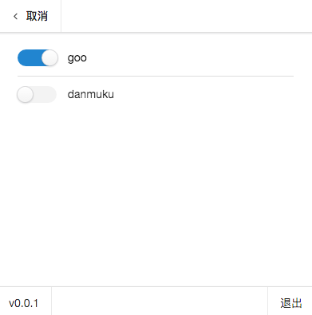

#barrage-nw


##开发
```
npm install


webpack -w //watch menu.js 也就是使用了react 写的一个东西
//其他部分都是写在html里面

nw . //启动应用，如果是开发模式下可以把menu.html 里面的关于 dev.js的script注释取消掉加载进来

// gulp stage 打包成stage模式下的应用


// gulp production 打包成生产环境下的应用，主要是里面的server_url是不一样的

```


###目录说明
build 是当你打包程序之后会产生的
cache 是默认的去下载nw的目录
dist 是webpack打包出的js的存放目录

resource 是一个近乎干净的主要程序的目录，也就是去掉了src等，直接将需要的复制进去，用于打包程序用的

src 是程序主要的目录，也就是react程序的目录

###打包说明

因为nw官方的版本里面的setAlwaysOnTop是在类似keynote这种软件play的时候，或者视频全屏播放的时候不能 top的，所以如果想支持这个技能，那么就只能从新编译自己hack的，当然我暂时只知道mac如何搞一下
[https://github.com/nwjs/nw.js/wiki/Building-nw.js](https://github.com/nwjs/nw.js/wiki/Building-nw.js)

然后mac下弄的话记得

```
for nw13 you'll need osx 10.10
for nw12, I prefer 10.8, but it also works with 10.9, never test it with 10.10
```

```
//在nw源代码里面的src/browser/native_window_mac.mm里面找到
void NativeWindowCocoa::SetAlwaysOnTop(bool top) {
  [window() setLevel:(top ? NSFloatingWindowLevel : NSNormalWindowLevel)];
}

//这个NSFloatingWindowLevel的level不够高，所以可以尝试用NSStatusWindowLevel

```

关于这里，想写一个关于nw的api
```SetAlwaysOnTopHappy(bool top)```
这个可以top在全屏时候也不影响的。不过windows和linux下貌似暂时还不会弄哦...so...😊

---
#####关于windows下
好像windows下面的win32 api也不能搞定的，因为就算win下面SetWindowPos了，如果其他窗口也是alwaysOnTop的打开，会覆盖掉原来的，看了一下Chromium源码，貌似也是通过SetWindowPos实现的，倒是有办法就是使用上面directx什么实现，不过貌似不需要这样吧，所以在windows下有一种hack的方法：

比如你先把task_bar给设置成可以隐藏的，然后打开视频全屏，然后用ctrl+tab切回到barrage程序这样就可以模拟了~~~😄

---


##简介

用了nw.js 开发的应用，然后主要的程序用的是react，因为es6需要babel来弄一下，而webpack是很棒的东西

##程序包
👉👉👉👉👉👉[下载](https://github.com/happy-barrage/barrage-nw/wiki/下载)👈👈👈👈👈👈

